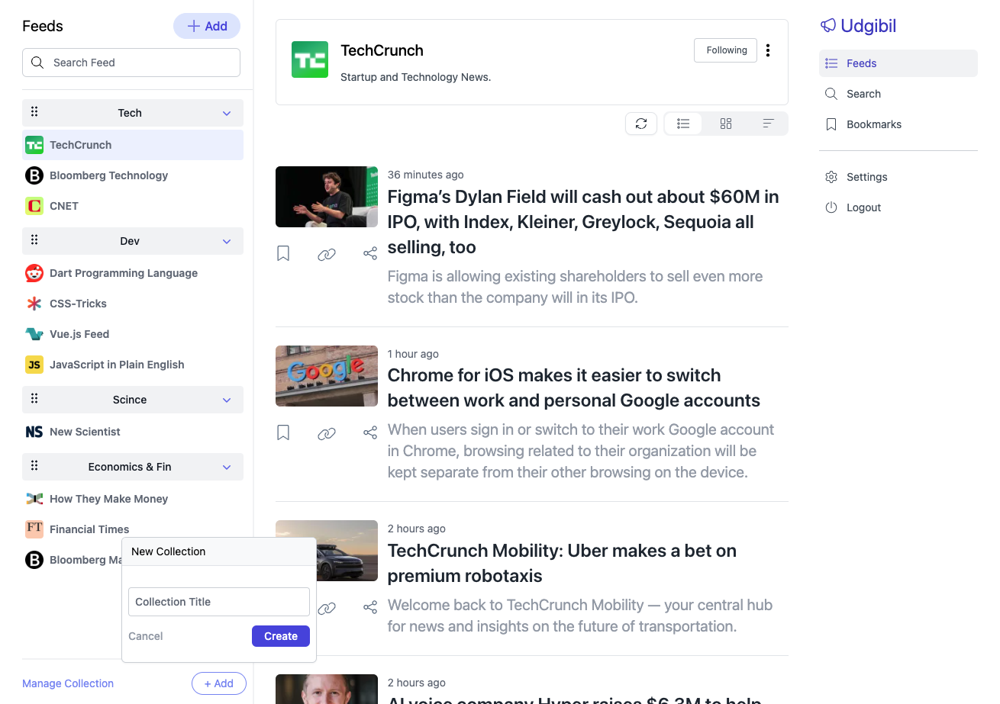

# Udgibil RSS Reader - Frontend

A modern Vue 3 application for reading and managing RSS feeds with advanced features including user authentication, feed management, article publishing, and multi-language support.

**Backend Repository:** [udgibil-back](https://github.com/booper/udgibil-back) - The API server that powers this frontend application.



## What is UD.GILIB?

**UD.GILIB** is an ancient Sumerian word that translates to **"news"** in English.

The word is made up of two parts:

- **UD** = day, time, daily
- **GILIB** = (combined with UD to mean news/information)

### Core Functionality

- **RSS Feed Management** - Subscribe to, organize, and browse RSS feeds
- **Article Reading** - Clean, responsive article reading experience
- **Bookmarking System** - Save and organize favorite articles
- **Publishing Platform** - Create and publish your own RSS feeds and articles
- **Collections** - Group feeds into custom collections
- **Search** - Find feeds and articles across your subscriptions

### User Experience

- **Multi-language Support** - Available in 9 languages (English, Russian, Ukrainian, Spanish, German, French, Italian, Portuguese, Chinese)
- **Dark/Light Theme** - Automatic theme switching with system preference detection
- **Responsive Design** - Optimized for desktop, tablet, and mobile devices
- **Onboarding Flow** - Guided setup for new users

### Technical Features

- **Authentication** - Secure user accounts with Google OAuth integration
- **Real-time Updates** - Live feed updates and notifications
- **Offline Support** - State persistence for offline reading
- **Rich Text Editor** - Full-featured article creation with Editor.js
- **Support System** - Built-in help desk and ticketing system

## Tech Stack

### Frontend Framework

- **Vue 3** - Latest Vue.js with Composition API
- **Vite** - Fast development server and build tool
- **Vue Router** - Client-side routing with authentication guards
- **Pinia** - Modern state management with persistence

### UI & Styling

- **Tailwind CSS** - Utility-first CSS framework with dark mode
- **Headless UI** - Accessible UI components for Vue
- **Heroicons** - Beautiful SVG icons
- **Vue Tippy** - Tooltips and popovers

### Rich Text & Media

- **Editor.js** - Block-styled rich text editor
- **ImageKit** - Image optimization and delivery
- **Chart.js** - Data visualization and analytics

### Utilities

- **Axios** - HTTP client with interceptors
- **Luxon** - Date and time manipulation
- **Vue i18n** - Internationalization framework
- **UUID** - Unique identifier generation

## Project Structure

```
src/
├── components/          # Vue components
│   ├── articles/       # Article display and interaction
│   ├── bookmarks/      # Bookmark management
│   ├── feeds/          # Feed browsing and management
│   ├── pub/            # Publishing platform features
│   ├── search/         # Search functionality
│   ├── shared/         # Reusable UI components
│   ├── support/        # Help desk system
│   └── icons/          # SVG icon components
├── composables/        # Vue composables
│   └── networks.js     # HTTP client utilities
├── languages/          # i18n translation files
├── pages/             # Top-level page components
├── router/            # Vue Router configuration
├── stores/            # Pinia store modules
│   ├── session.js     # Auth, theme, language state
│   ├── user.js        # User profile and preferences
│   ├── feeds.js       # RSS feeds management
│   ├── articles.js    # Article data and interactions
│   ├── bookmarks.js   # Bookmarked articles
│   ├── collections.js # User-created feed collections
│   ├── myfeeds.js     # User's published feeds
│   └── tickets.js     # Support ticket system
└── styles/            # Global styles and Tailwind config
```

## Development Setup

### Prerequisites

- Node.js 18+
- npm 8+

### Installation

1. **Clone the repository**

   ```bash
   git clone <repository-url>
   cd udgibil-front
   ```

2. **Install dependencies**

   ```bash
   npm install
   ```

3. **Environment Configuration**
   Create environment files:

   ```bash
   # Development
   cp env.development.txt .env.development

   # Production
   cp env.production .env.production
   ```

   Configure the API URL:

   ```env
   VITE_API_URL=https://your-api-endpoint.com
   ```

4. **Start development server**

   ```bash
   npm run dev
   ```

   The application will be available at `http://localhost:8080`

### Available Scripts

- `npm run dev` - Start development server with hot reload
- `npm run build` - Build for production
- `npm run preview` - Preview production build locally
- `npm run lint` - Run ESLint with auto-fix

## Architecture

### Layout System

The application uses a sophisticated nested routing system with multiple layouts:

- **Main Layout** (`SkeletonPage`) - Three-column layout for feed browsing
- **Bookmark Layout** (`SkeletonBookmarkPage`) - Dedicated bookmark management
- **Publishing Layout** (`PubSkeletonPage`) - Content creation interface
- **Settings Layout** - Full-page configuration interface

### State Management

Pinia stores are organized by domain with automatic persistence:

- **Session Store** - Authentication tokens, theme preferences, language settings
- **User Store** - Profile data, preferences, subscription settings
- **Feeds Store** - RSS feed subscriptions and metadata
- **Articles Store** - Article cache, read status, interactions
- **Bookmarks Store** - Saved articles with tags and notes
- **Collections Store** - User-defined feed groupings

### Authentication Flow

1. User signs in via standard auth or Google OAuth
2. JWT tokens stored securely with automatic refresh
3. Route guards protect authenticated areas
4. New users guided through onboarding process

### API Integration

Centralized HTTP client with:

- Automatic Bearer token injection
- Request/response interceptors for error handling
- Environment-based endpoint configuration
- Retry logic for failed requests

## Publishing System

The application includes a complete content management system:

### Content Creation

- **Rich Text Editor** - Editor.js with custom blocks
- **Media Management** - Image upload and optimization via ImageKit
- **Preview Mode** - Real-time content preview
- **Draft System** - Save and resume article editing

### Feed Management

- **Custom RSS Feeds** - Create and manage personal feeds
- **Content Scheduling** - Schedule article publication
- **Analytics** - Track feed performance and reader engagement
- **Import/Export** - Bulk content management tools

## Internationalization

Full i18n support with comprehensive language coverage:

### Supported Languages

- English (en)
- Russian (ru)
- Ukrainian (uk)
- Spanish (es)
- German (de)
- French (fr)
- Italian (it)
- Portuguese (pt)
- Chinese (zh)

### Translation Management

- JSON-based translation files
- Reactive language switching
- RTL support for applicable languages
- Date/time localization with Luxon

## Deployment

### Build Process

```bash
npm run build
```

Generates optimized production build with:

- Code splitting and lazy loading
- Asset optimization and compression
- Service worker for offline support
- Source maps for debugging

### Environment Variables

- `VITE_API_URL` - Backend API endpoint
- `VITE_IMAGEKIT_URL` - ImageKit CDN endpoint
- `VITE_GOOGLE_CLIENT_ID` - Google OAuth client ID

### Performance Optimizations

- Memory allocation increased to 4GB for large builds
- Tree shaking for minimal bundle size
- Image lazy loading and optimization
- Component-level code splitting

## Browser Support

- Chrome 88+
- Firefox 85+
- Safari 14+
- Edge 88+

## Contributing

### Code Style

- ESLint configuration with Vue-specific rules
- Composition API with `<script setup>` syntax
- Tailwind CSS for consistent styling
- Component props validation and TypeScript support

### Development Guidelines

1. Follow existing component patterns and naming conventions
2. Use Pinia stores for shared state management
3. Implement proper error handling and loading states
4. Add appropriate i18n keys for new features
5. Test across different themes and languages

## Security

- JWT token management with secure storage
- CSRF protection via token-based authentication
- XSS prevention through Vue's built-in sanitization
- Secure HTTP-only cookies for sensitive data
- Content Security Policy headers

## Performance

### Optimization Features

- Virtual scrolling for large feed lists
- Image lazy loading and progressive enhancement
- Component-level caching and memoization
- Efficient state updates with minimal re-renders
- Background sync for offline functionality

### Monitoring

- Performance metrics tracking
- Error logging and reporting
- User interaction analytics
- Feed update success rates

## License

This project is licensed under the MIT License - see the LICENSE file for details.

## Support

For support, follow [@Enkiboo](https://x.com/Enkiboo) on X (Twitter).

---

Built with ❤️ using Vue 3, Tailwind CSS, and modern web technologies.
